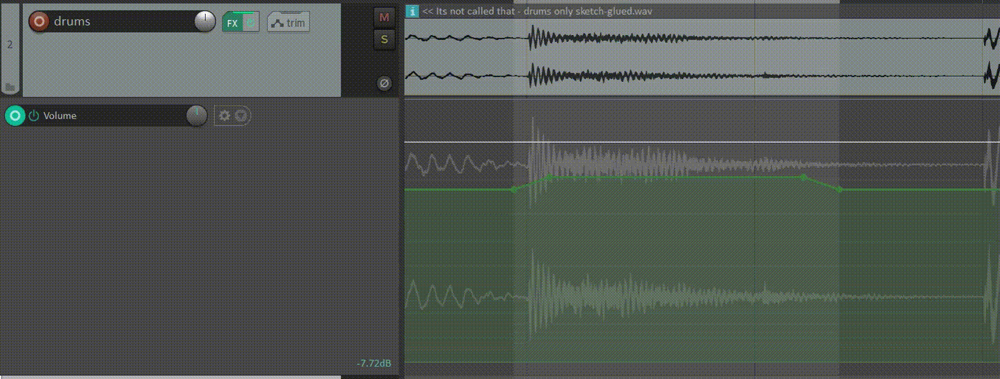
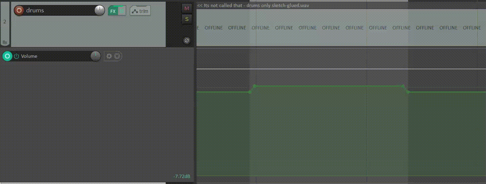

# Install

ReaPack index file is available here:

```
https://raw.githubusercontent.com/thelastaxestudio/reascripts/stable/index.xml
```

# Micro automation scripts
The MicroAutomation scripts are tailored around tweaking envelopes in Reaper, without the need for the mouse.

## Scripts for use with rotary encoders 

### TLA_MicroAutomation_Create
Creates a four-point envelope with offset inner points on the selected envelope and attenuates it based on the input value of the rotary encoder (between 0 and 127). If four selected or unselected points exist within the selection, the script will select and attenuate those points, otherise the script will clear any points within the selection and create a new four-point selection to attenuate.


### TLA_Adjust_offset
Adjusts the offset of the inner points in a four-point envelope.




### TLA_Attenuate_first_inner_point
Adjust only the value of the first inner point, for creating an ascending or descending envelope.



### TLA_Attenuate_last_inner_point
Adjust only the value of the last inner point, for creating an ascending or descending envelope.


## Scripts for use with pads (or as simple actions)

### TLA_Shift_opening_points_left & TLA_Shift_opening_points_right
Jog the first two points of a four-point envelope to the left or right.


### TLA_Shift_closing_points_left & TLA_Shift_closing_points_right
Jog the last two points of a four-point envelope to the left or right.


## Support

Found an issue? Message me at `thelastaxe` on Discord, or file an issue with this repo.


## Run unit tests

```
docker run --rm -it -v ${PWD}/the-last-axe:/data -e 'LUA_PATH=/data/?.lua'  imega/busted
```